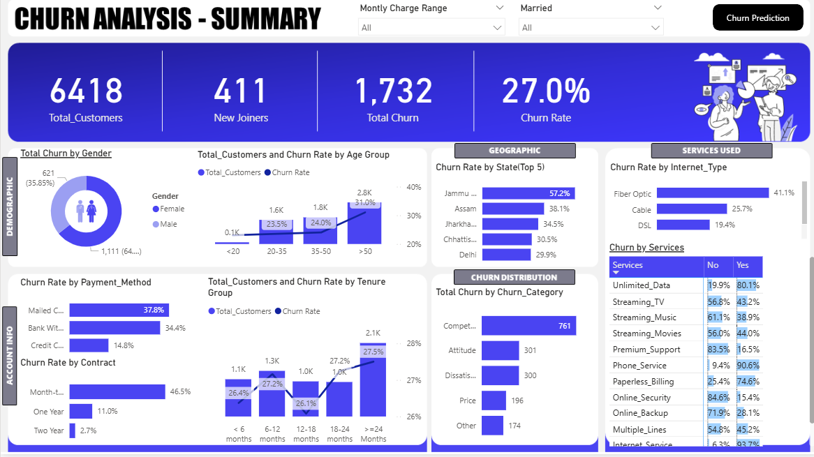
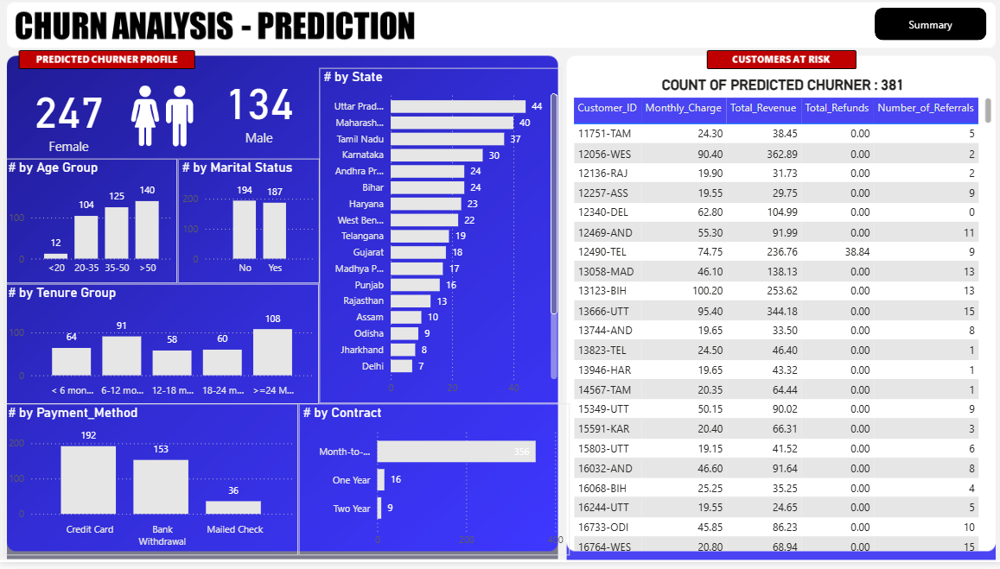

# 🚀 Customer Churn Analysis Dashboard

**End-to-End analytics project analyzing telecom customer churn using SQL ETL, Power BI visualization, and Random Forest ML (84% accuracy)**

## 📊 Project Overview
- **Dataset**: 6,418 telecom customers with 17.5% churn rate 【685.079, type: source】 
- **Tech Stack**: SQL Server, Power BI, Python (Pandas, Scikit-learn)

## ✨ Key Features
- Interactive Power BI dashboard with demographic/geographic churn analysis
- Random Forest model predicting future churners
- Actionable insights for retention marketing

## 📈 Live Dashboard Screenshots

## 🚀 Quick Demo
[Watch the project walkthrough](your-linkedin-post-link)

## 💼 Skills Demonstrated
**SQL** | **Power BI** | **Python** | **ETL** | **Data Visualization** | **Machine Learning**

---
⭐ **Star this repo if you found it helpful!** Connect on [LinkedIn]([your-linkedin](https://www.linkedin.com/in/jeny-grace-thomas-24aa31365))

